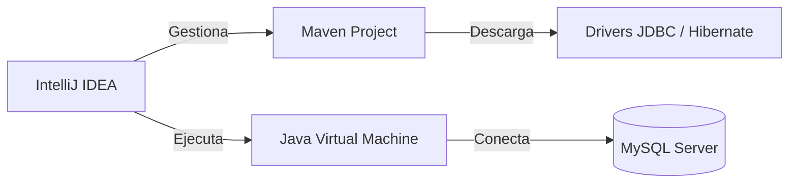

# 🛠️ Configuración del Entorno

Antes de empezar a picar código, necesitamos que tu equipo sea un entorno de desarrollo profesional. En este tutorial configuraremos las herramientas que usaremos durante todo el curso.

## Prerrequisitos

Para que todo funcione a la primera, asegúrate de tener:
- **JDK 17 o superior** (Recomendado JDK 21 LTS).
- **IntelliJ IDEA Community o Ultimate**.
- **MySQL Server** (puedes usar XAMPP para facilitar la gestión).

## Diagrama de Comunicación

Así es como se comunicarán nuestras herramientas:



---

## Paso 1: Verificación de Java

Abre una terminal (PowerShell o CMD) y comprueba que tienes el JDK instalado correctamente:

```bash
java -version
javac -version
```

:::tip ¿No lo tienes?
Si no te devuelve la versión, descarga el **OpenJDK 21** desde [Adoptium](https://adoptium.net/) y asegúrate de marcar la opción "Add to PATH" durante la instalación.
:::

## Paso 2: Creación del Proyecto Maven

Maven es nuestra herramienta de gestión de proyectos. Nos permite añadir librerías (como el conector de base de datos) simplemente escribiendo unas líneas en un fichero llamado `pom.xml`.

1. Abre IntelliJ IDEA y selecciona **New Project**.
2. Elige **Maven Archetype** o simplemente **Maven**.
3. **Name:** `ad-primer-proyecto`
4. **JDK:** Selecciona tu versión 21.

## Paso 3: Entendiendo el `pom.xml`

El archivo `pom.xml` es el corazón de tu proyecto. Aquí definimos quiénes somos y qué necesitamos.

```xml title="pom.xml"
<?xml version="1.0" encoding="UTF-8"?>
<project xmlns="http://maven.apache.org/POM/4.0.0"
         xmlns:xsi="http://www.w3.org/2001/XMLSchema-instance"
         xsi:schemaLocation="http://maven.apache.org/POM/4.0.0 http://maven.apache.org/xsd/maven-4.0.0.xsd">
    <modelVersion>4.0.0</modelVersion>

    <groupId>es.iesagora.ad</groupId>
    <artifactId>ut01-introduccion</artifactId>
    <version>1.0-SNAPSHOT</version>

    <properties>
        <maven.compiler.source>21</maven.compiler.source>
        <maven.compiler.target>21</maven.compiler.target>
        <project.build.sourceEncoding>UTF-8</project.build.sourceEncoding>
    </properties>

    <dependencies>
        <!-- Aquí añadiremos las librerías más adelante -->
    </dependencies>

</project>
```

:::info ¿Por qué Maven?
Sin Maven, tendrías que descargar archivos `.jar` manualmente, meterlos en carpetas y rezar para que no haya conflictos de versiones. Maven lo hace por ti automáticamente.
:::

---

## ¡Proyecto Listo!

Si has llegado hasta aquí y el proyecto en IntelliJ no muestra errores en rojo, ¡estás listo para empezar! En la próxima unidad empezaremos a jugar con el sistema de ficheros.
