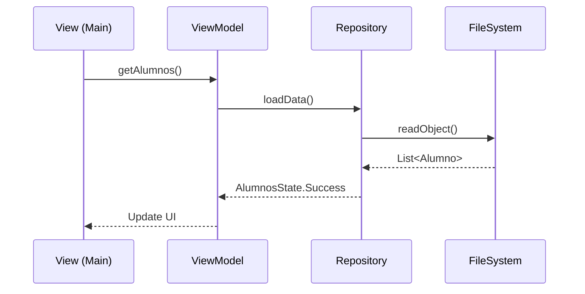

# 🚀 CRUD con Ficheros

Implementaremos un sistema de gestión de alumnos persistido en un fichero binario.

## Prerrequisitos
- Proyecto Maven configurado.
- Conocimientos básicos de Java (Clases y Listas).

## Diagrama de Arquitectura (MVVM)


## Implementación del Repositorio
```java
// src/main/java/repository/AlumnoRepository.java
public class AlumnoRepository {
    // Lógica de lectura/escritura en fichero
}
```
