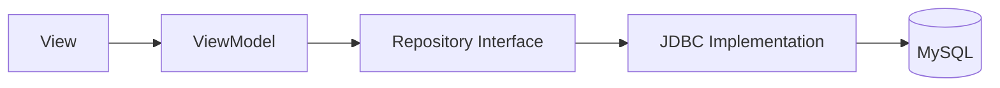

# 🏗️ JDBC Repository Pattern

Aprenderemos a separar la lógica de negocio de la persistencia usando un Repositorio JDBC.

## Arquitectura


## Ejemplo de Conexión
```java
// src/main/java/database/DatabaseManager.java
public class DatabaseManager {
    // Configuración de la conexión con strings.xml
}
```
